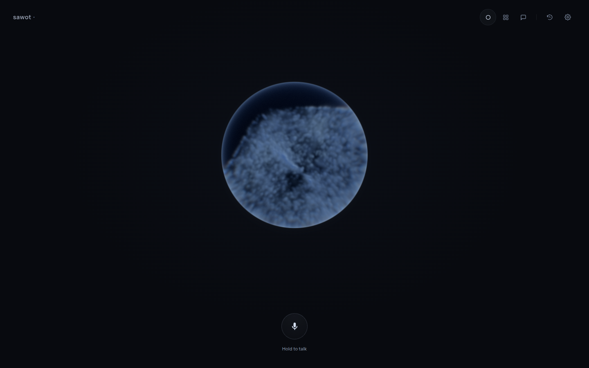
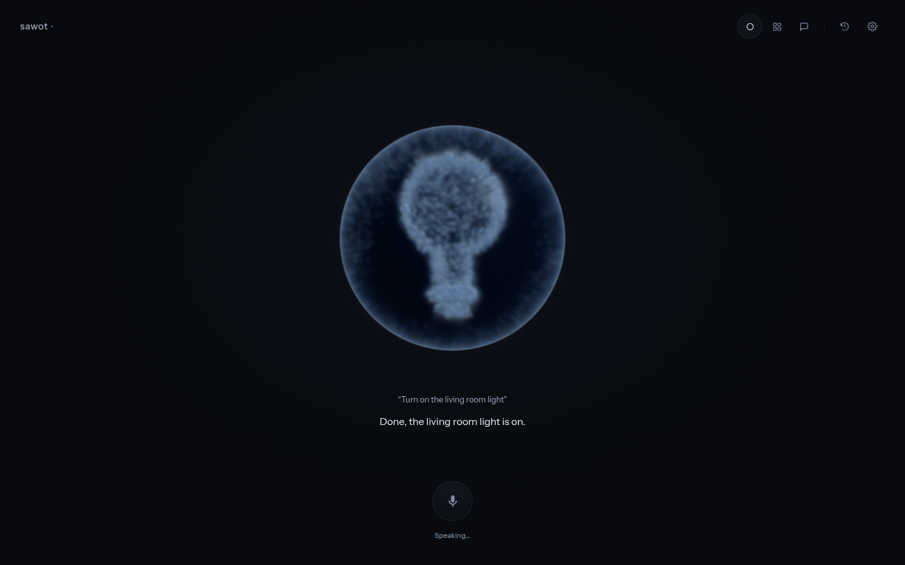
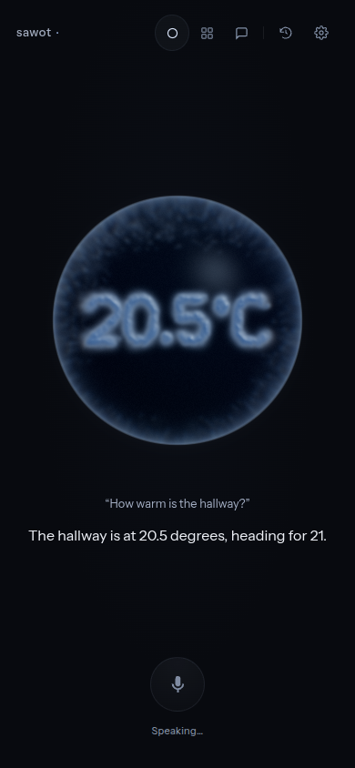
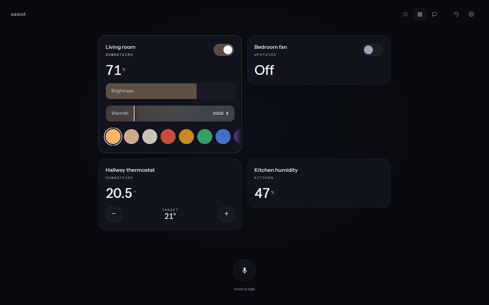
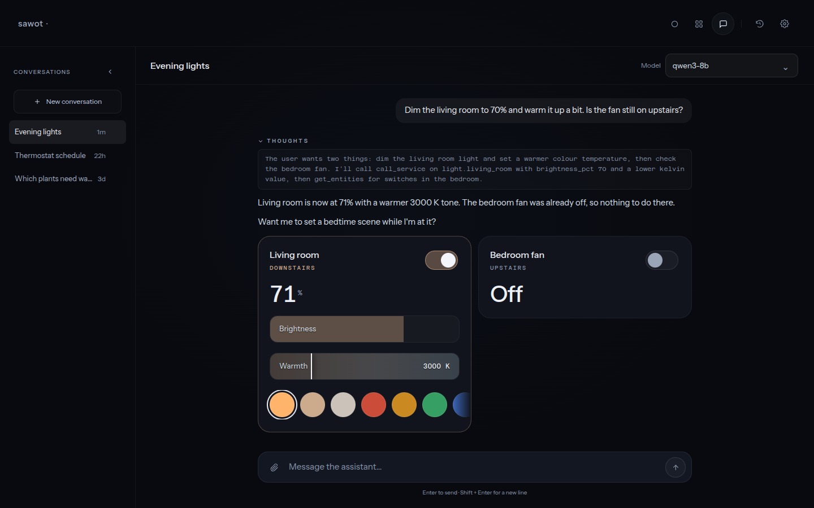
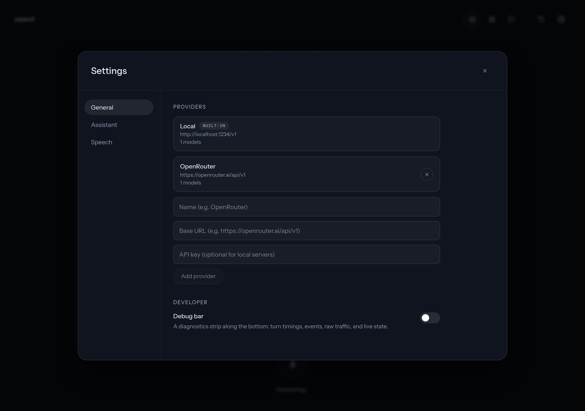
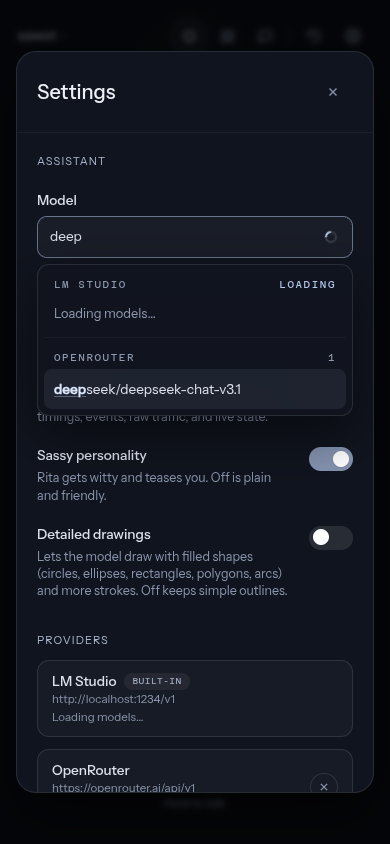
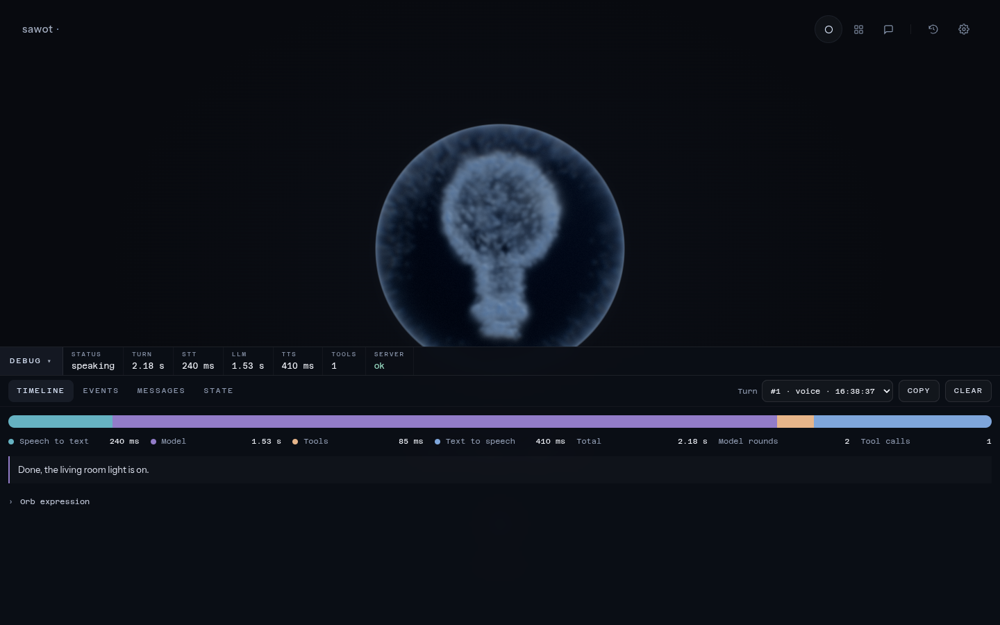

# SAWOT

> **Work in progress.** SAWOT is under active development. Expect rough
> edges, breaking changes between commits, and features that are documented
> before they are finished. Feedback and issues are welcome.

Fully local voice and chat assistant for Home Assistant: push-to-talk in the
browser, CPU speech-to-text via
[transcribe.cpp](https://github.com/handy-computer/transcribe.cpp), an LM
Studio (or any OpenAI-compatible) LLM with Home Assistant tool calling, and
[Kokoro](https://github.com/hexgrad/kokoro) text-to-speech — no cloud required.

The assistant lives in a glass orb full of moving ink. The model chooses what
the ink forms: a light bulb when it switches a lamp, a thermometer reading when
you ask about the heating, a smile when it is pleased with itself.

> **Security note:** this server has **no authentication** and can control
> your devices over the network. Authentication is planned but not yet
> implemented. Until then, run it only on a trusted LAN, or bind
> `server.host` to `127.0.0.1`. See [SECURITY.md](SECURITY.md).



## Features

- **Voice assistant** — hold the button, speak, release. Local STT → LLM →
  TTS pipeline with live per-turn latency traces.
- **Expressive orb** — 6,144 persistent ink particles inside a lensed glass
  sphere. The particles gather into a torus knot while the model thinks, ripple
  with the reply as it is spoken, and form what the model chooses to show.
  With every reply the model can either pick one of 28 predefined shapes
  (faces, home symbols, statuses, weather), show a short text or number
  readout, or free-hand sketch whatever it wants. Sketch quality scales with
  the model: a large model draws a recognisable cat or house, a small one
  should stick to the predefined shapes. Shapes are formed by moving the
  existing ink, never by swapping in an icon.
- **Home Assistant control** — the model uses tools (`get_entities`,
  `call_service`) to list and control your devices, then shows touch-first
  control cards for anything it touched. Verified temperature readings from
  your sensors and thermostats can be drawn as numeric ink.
- **Devices view** — toggle lights and switches, drag brightness and colour
  temperature bars, pick colours, and step thermostat targets directly from
  the cards.
- **Chat** — a ChatGPT-style interface with multiple server-stored
  conversations, streaming replies, collapsible reasoning, inline device
  cards, and the same Home Assistant tools.
- **Attachments** — upload images (vision models), text files, and PDFs
  (extracted text is sent inline to the model).
- **Personality** — "Rita" ships with a sassy, teasing persona that you can
  switch off from Settings for a plain, friendly assistant.
- **Custom providers** — add any OpenAI-compatible endpoint (OpenRouter,
  Ollama, vLLM, OpenAI, …) with its API key from Settings. Every provider's
  models appear in one searchable, fuzzy-filtered picker, each provider
  loading on its own so a sleeping LM Studio never blocks the rest. Models
  that only take tools through the Responses API (OpenAI's gpt-6 family) are
  detected from the provider's first error and switched over automatically,
  thinking included.
- **Choice of speech engines** — Kokoro by default, or Resemble AI's
  Chatterbox Turbo and Nano (expressive, `[laugh]`-style tags, voice cloning
  from a short WAV). Download and switch from Settings.
- **Live settings** — switch the model, voice, personality, and drawing detail
  at runtime; choices apply instantly and persist to `settings.json`.
- **Debug bar** — an optional diagnostics strip with a per-turn timeline
  (STT, model, tools, TTS), every backend event, raw traffic in both
  directions, and live state.
- **OpenAI-compatible audio API** — `POST /v1/audio/speech` (TTS) and
  `POST /v1/audio/transcriptions` (STT) let any OpenAI SDK client use the
  local engines as a drop-in speech backend.

## Screenshots

**The orb answers with ink** — a bulb after switching a light, and a
thermometer reading on a phone:





**Devices** — control cards for everything the assistant touched:



**Chat** — reasoning, streaming replies, and inline cards:



**Settings** — model picker across providers, voice, personality, drawing
detail, and speech model downloads:





**Debug bar** — the turn timeline with the reply and its orb expression:



## Architecture

- `ts-backend/` — TypeScript (Fastify) backend: WebSocket voice pipeline, chat
  (SSE), settings, provider registry, Home Assistant client, the LLM agent +
  tools, and the orb expression catalogue. Proxies STT/TTS to the Python
  sidecar.
- `sidecar/` + `server/` — Python (FastAPI) inference sidecar: transcribe.cpp
  STT, Kokoro / Chatterbox TTS, and the model download manager.
- `web/` — TypeScript (React + Vite + Three.js) frontend, built into
  `web/dist/`. The ink simulation, shape fields, stroke font, and shader live
  under `web/src/lib/` and `web/src/shaders/`.
- `config.yaml` + `.env` — runtime configuration and the HA token.
- `Dockerfile` + `docker-compose.yml` — one CPU image running both processes,
  published to `ghcr.io/edmasoud95/sawot` on every push to main.

## Prerequisites

- Linux (native or WSL2). Speech-to-text runs on CPU (GGUF); text-to-speech
  uses an NVIDIA GPU when present and falls back to CPU.
- `sudo apt install espeak-ng ffmpeg`
- Node.js 20+ and npm (TypeScript backend + frontend)
- [LM Studio](https://lmstudio.ai/) running with a tool-calling model loaded
  (recommended: Qwen3-8B Q4) and its local server enabled — or any other
  OpenAI-compatible provider added from Settings
- A Home Assistant
  [long-lived access token](https://www.home-assistant.io/docs/authentication/#your-account-profile)
  (HA → Profile → Security → Long-lived access tokens)

## Quick start with Docker

The fastest way to run SAWOT is the prebuilt CPU image. You need Docker, a
Home Assistant long-lived access token, and LM Studio (or any
OpenAI-compatible server) running on the same machine or LAN.

```bash
git clone https://github.com/Edmasoud95/sawot.git && cd sawot
cp .env.example .env      # set HA_URL and HA_TOKEN
docker compose up -d
```

Open <http://localhost:8765>, then download the speech models from Settings
(Cohere Transcribe and Kokoro are the recommended defaults) and pick a model
from your provider. Everything the container writes — downloaded models,
settings, chat history — lands in `./data`, so `docker compose pull && docker
compose up -d` upgrades without losing anything.

Inside the container, `host.docker.internal` is the machine running Docker,
which is where the LM Studio default points. Set `LM_STUDIO_URL` in `.env`
if it runs elsewhere. The image is CPU-only (x86_64); speech works well on a
modern CPU, and a GPU image is planned.

## Setup (native)

```bash
python3 -m venv .venv
.venv/bin/pip install -r requirements.txt
cp config.example.yaml config.yaml   # HA URL, LM Studio URL, model name
cp .env.example .env                 # paste your HA token
(cd ts-backend && npm install && npm run build)   # TypeScript backend
(cd web && npm install && npm run build)          # UI into web/dist
```

> **Tip — setup wizard:** `.venv/bin/python scripts/setup.py` walks through
> configuration and downloads the STT + TTS models in one go.

If LM Studio runs on the Windows host under WSL2, find its IP with
`ip route show | grep default`.

## Configuration

Edit `config.yaml`:

| Key | Description |
| --- | --- |
| `home_assistant.url` | Your Home Assistant URL |
| `lm_studio.url` | LM Studio server URL (LAN IP of the host) |
| `lm_studio.model` | The tool-calling model loaded in LM Studio |
| `stt.model` | STT model id (default `cohere-transcribe`; see Settings for the list) |
| `stt.language` | Transcription language (default `en`) |
| `tts.voice` | Kokoro voice (see the Settings panel for the list) |
| `tts.lang_code` | Kokoro language code (default `a` = American English) |
| `assistant.name` | Assistant name in the system prompt (default `Rita`) |
| `assistant.personality` | `sassy` (default) or `plain` |
| `server.host` / `server.port` | Bind address / port (default `0.0.0.0:8765`) |
| `controls` | Optional per-domain service whitelist override |
| `tls.certfile` / `tls.keyfile` | Optional — required for phone mic access over https |

Put your Home Assistant token in `.env` as `HA_TOKEN=...`.

Every key can also come from the environment, which wins over the file, so a
container needs no `config.yaml` at all. Only `HA_URL` and `HA_TOKEN` are
required; the rest default to the values above.

| Environment variable | `config.yaml` key |
| --- | --- |
| `HA_URL` | `home_assistant.url` |
| `LM_STUDIO_URL` / `LM_STUDIO_MODEL` | `lm_studio.url` / `lm_studio.model` |
| `STT_MODEL` / `STT_LANGUAGE` | `stt.model` / `stt.language` |
| `TTS_VOICE` / `TTS_LANG_CODE` | `tts.voice` / `tts.lang_code` |
| `ASSISTANT_NAME` / `ASSISTANT_PERSONALITY` | `assistant.name` / `assistant.personality` |
| `SERVER_HOST` / `SERVER_PORT` | `server.host` / `server.port` |
| `TLS_CERTFILE` / `TLS_KEYFILE` | `tls.certfile` / `tls.keyfile` |
| `SAWOT_DATA_DIR` | where `settings.json`, `data/` and `models/` live (default: beside `config.yaml`; `/data` in Docker) |

Custom LLM providers and their API keys are added from Settings and stored in
`settings.json` (gitignored). Keys are never returned by the API.

## Models

Speech-to-text and text-to-speech models are downloaded on demand into a local
`models/` directory (gitignored). Two ways to fetch them:

- **Settings** → a download button next to each STT/TTS model, with a progress
  bar. The recommended model for each kind is flagged. Downloaded TTS and STT
  models can be switched with one click.
- **Setup wizard** → `.venv/bin/python scripts/setup.py`.

The STT catalog mirrors [Handy](https://github.com/cjpais/Handy)'s: quantized
GGUF models (Cohere Transcribe, Parakeet, Whisper Large v3 Turbo, Canary) run
on CPU by [transcribe.cpp](https://github.com/handy-computer/transcribe.cpp) —
no CUDA or Hugging Face account needed. Recommended defaults: Cohere
Transcribe (STT — top of the Open ASR Leaderboard, 14 languages, 1.6 GB) and
Kokoro-82M (TTS). Once downloaded, the server runs fully offline.

### Chatterbox Turbo and Nano (optional)

Two extra TTS engines from Resemble AI. Turbo (350M) is expressive and low
latency on a GPU; Nano (110M) also runs well on CPU. Both understand tags such
as `[laugh]` or `[chuckle]` in the text and can clone a voice: drop a short WAV
into `models/tts/voices/` and it appears in the voice picker under its file
name. They need an optional package installed first, see
`requirements-chatterbox.txt` for the exact commands, then download either
model from Settings and click it to switch.

## Run

```bash
./run.sh
```

`run.sh` starts the Python inference sidecar (STT/TTS) and the TypeScript
backend, building `ts-backend/dist` and `web/dist` first if they're missing.

Open <http://localhost:8765>, or `http://<machine-ip>:8765` from another device
on your LAN (use `https://` when TLS is configured).

## Usage

### Voice

Hold the button, speak, release. Captions for what you said and what the
assistant replied appear under the orb during a turn. With TLS configured
(self-signed cert in `certs/`), use `https://` — required for phone microphone
access (accept the certificate warning once per device).

### How the orb draws

With every reply the model decides what the ink forms, either through a
hidden marker at the start of the spoken text or by calling the
`show_on_orb` tool. It has three options:

- a **predefined shape** from the catalogue of 28, such as `bulb`,
  `thermometer`, `lock`, `happy`, `rain` (the full list with meanings is in
  `ts-backend/src/expressions.ts`). These always look right because the
  outlines are built in;
- a **readout** of up to twelve characters, on one or two lines;
- a **free-hand sketch** of anything it wants, as polylines in a unit square.
  The prompt tells the model never to refuse a drawing request: people become
  stick figures, faces a circle with features, feelings and abstract ideas a
  symbol. Turn on **Detailed drawings** in Settings to let it use filled
  primitives (circles, ellipses, rectangles, polygons, arcs) and more strokes.

How good the sketches are depends entirely on the model. Large models
(Qwen3-32B, DeepSeek, GPT-class) produce recognisable drawings; small models
(8B and under) tend to produce scribbles, so with those it is better to rely
on the predefined shapes and readouts.

The backend validates and strips the markers, so nothing reaches speech,
captions, or history. Device actions form their own symbols while a tool runs,
and a verified temperature reading outranks everything else. Every final reply
is appended to `data/orb-replies.log` with its parsed expression so a missing
drawing can be diagnosed.

### Devices (grid icon)

Control cards for the devices each answer touched — toggle lights and
switches, drag brightness and warmth bars, pick colours, and step thermostat
targets. Every target is at least 44 px for touch.

### Chat (speech-bubble icon)

Text chat with multiple server-stored conversations (`data/conversations/`),
streaming replies with collapsible thinking, a per-conversation model picker,
image/text/PDF uploads, the same Home Assistant tools, and inline device cards.

### History (clock icon)

The voice conversation log for this session, with a per-turn pipeline trace
when the debug bar is on.

### Settings (gear icon)

Model (searchable across every provider), voice, sassy personality, detailed
drawings, the debug bar, custom providers, and STT/TTS model downloads. Changes
apply instantly and persist.

### Debug bar

Switch it on from Settings. Collapsed, it shows live tiles: status, last turn
total, STT, model, and TTS latencies, tool call count, and server health.
Expanded, it has four tabs — Timeline, Events, Messages, and State — a turn
picker for the last twenty turns, and a Copy button that puts a turn's JSON on
the clipboard. Chat mode emits the same events over its stream.

## Tests

```bash
.venv/bin/pytest                                     # Python sidecar (STT/TTS/models)
(cd ts-backend && npm run typecheck && npx tsx --test tests/*.test.ts)
(cd web && npm run typecheck && npx vitest run)
```

The TypeScript suites cover the provider registry and per-provider loading,
the Responses API transport and reasoning fallback, expression parsing and the
orb tool, temperature readings, the ink simulation, readout font, expression
priority, fuzzy matching, and the debug store.

## Development

Frontend hot reload: `cd web && npm run dev` (proxies `/ws` to the backend).
Backend dev: `cd ts-backend && npm run dev` (needs the sidecar running — see
`./run_sidecar.sh`).

## Extending

- **Tools** — the LLM agent consumes a list of `Tool` objects
  (`ts-backend/src/tools.ts`); Home Assistant tools are one provided set
  (`buildHaTools`). Add a `Tool` and pass it to `Agent` to teach the assistant
  new skills.
- **Expressions** — add a name and meaning to the catalogue in
  `ts-backend/src/expressions.ts` and a matching distance field in
  `web/src/lib/inkShapes.ts`; the system prompt lists the catalogue
  automatically.
- **Providers** — `ts-backend/src/providers.ts` holds the registry; any
  OpenAI-compatible endpoint works without code changes, and
  `responsesTransport.ts` handles the Responses API for models that need it.
- **Engines** — the Python sidecar exposes STT/TTS over HTTP
  (`server/stt.py`, `server/tts.py`); swap them for any backend without touching
  the TypeScript code.
- **Voice pipeline** — `ts-backend/src/pipeline.ts` exposes the STT → agent →
  TTS turn independent of the WebSocket transport.
- **OpenAI API** — the sidecar registers `/v1/audio/speech`,
  `/v1/audio/transcriptions`, and `/v1/models`; the TypeScript backend proxies
  them at the same paths.

## License

[MIT](LICENSE) © 2026 Ed Masoud
